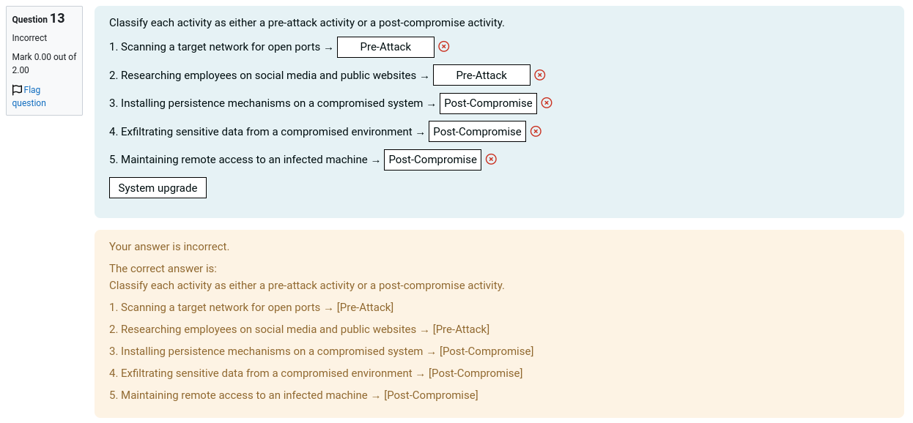
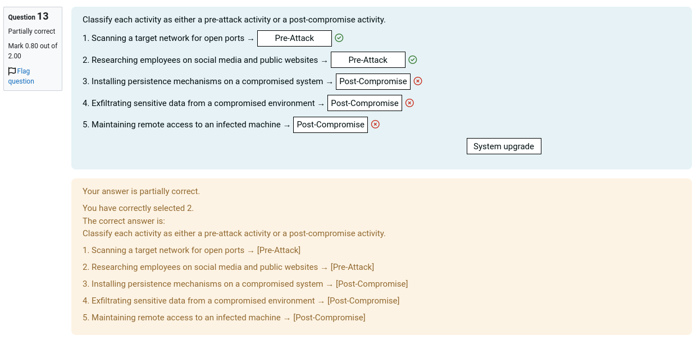

## Module 1 completion assessment
It felt like the questions were yes, on the topic, but it would have been a bit 'nicer' to have them explored throughout the videos as interactive questions first.

## LAB 02
all 'hackthissite.org' instances in the document (in the copy-paste commands) aren't written well (hacthissite.org instead of hackthissite.org)
all 'reconnaissance' instances aren't spelled correctly
at the nmap command, it tells to ```nmap hackthiswebsite.org``` but the website doesn't exist (I assumed it was hackthissite.org)
A little bit more information on what each command provides would be nice as additional documentation

I was never able to reach ```testphp.vulnweb.com``` as it was always too used


| NUM | SUN - WED | THU - SAT |
|:---:|-----------|-----------|
| 1+  | 2H        | 2H        |
| 3+  | 2H30      | 2H30      |
| 5+  | 3H        | 3H        |
| 13+ | 3H30      | 4H        |


## LAB 03

the file is called 'lab 7' and the title is Lab Exercise 7 which is confusing since it is the thrid lab
having the myhomelab.local part already done on lab 1 would make it easier to workflow the lab


## assessment 1

Which of the following would MOST likely impact confidentiality? (Choose all that apply)
Question 3 Answer
a.

Sensitive files being leaked publicly
b.

Data being modified without permission
c.

System downtime
d.

USB Drive stolen
e.

Unauthorized access to customer data

AND FOR QUESTION : 

Which of the following actions indicate pre-attack behavior? (Select all that apply)
Question 7 Answer
a.

Encrypting stolen data
b.

Researching employees online
c.

Sending phishing emails
d.

Scanning open ports


->> but can only choose one




again, on second attempt




## LAB 04

(lab exercice 9)

** there is also no lab walkthrough for this lab, which can be especially confusing for new cisco packet tracer users

having screenshots of what devices should be dragged and dropped is very useful or where to find things (such as configuring the gateway on the PC)

also instructions like "Open the command prompt of PC1 and ping 192.168.1.1 (gateway)" should have a path like : open the command prompt (PC1 -> Desktop -> Command Prompt)


## MODULE 5 COMPLETION ASSESSMENT

there is no module 5 completion assessment :()

## MODULE 6
same as module 5


## MODULE 7

### symetric and asymetric encryption video

there is no 'submission' button to submit the answers

### hashing & PKI

the sound is very low
same as sym and asym encryption video : there is no submisssion button


### intro to cysec risk

no sound (0:43 - 1:26)
+ no sub button
